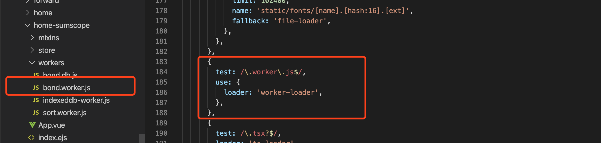

## 起步

*注：由于现阶段前端模块化进化异常迅速，甚至达到了变异的程度，此分享着重以webpack搭建为主，并且以finchat项目为例子*
<hr>

- 独立worker文件  
需要构建工具（webpack）区别相应文件，那么则需要相应的 [loaders](https://webpack.docschina.org/loaders)，而我们用到了worker，那么我们则需要 [worker-loader](https://webpack.docschina.org/loaders/worker-loader)，剩下来的就是一顿操作配置webpack的相应配置；

```bash
$ npm install worker-loader --save-dev
```

```js
// 项目中配置
{
	test: /\.worker\.js$/,
	use: {
		loader: 'worker-loader',
	}
}
```

**.worker.js结尾的文件都交给worker-loader来处理**




